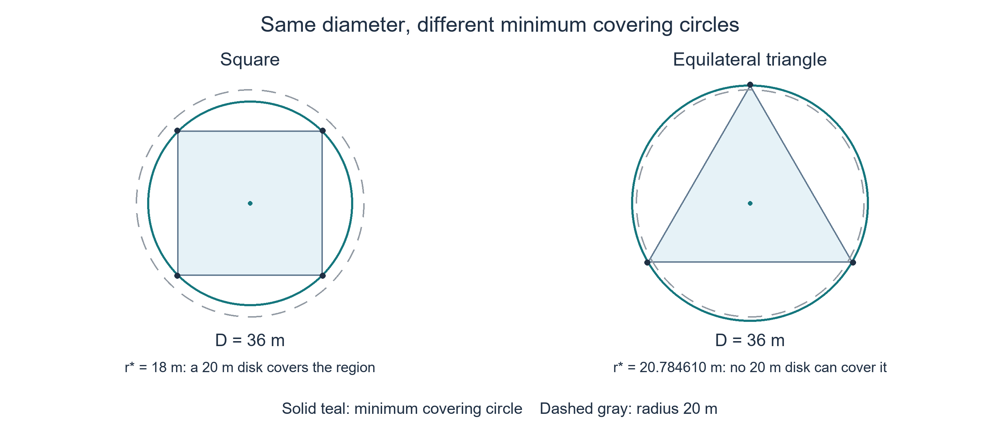

## 问题一 有界测向误差下的定位区域与覆盖判定

示向度给出了干扰源相对于检测点的方向范围。本文将这些方向范围写成半平面约束，求交构造定位多边形，以旋转卡壳计算区域直径，并检验直径圆是否覆盖全域。针对后续清除任务，进一步利用 Jung 定理估计最小包围圆半径，再以 Welzl 随机增量算法确定多边形的最小包围圆。

问题一的两个核心结论是：**凸多边形的直径等于其最远顶点对的距离；以该直径为直径的圆不一定覆盖整个区域。** 判定覆盖需要检查整个区域相对于指定圆心的最大距离。Jung 定理给出覆盖圆存在性的界，Welzl 算法求解具体圆心和半径，二者承担不同作用。

### 1. 测向约束与定位区域

#### 1.1 数据约定与误差模型

以目标区域圆心为原点，正东、正北分别为坐标轴正向，坐标单位为米，方位角从正东逆时针计量。设检测点为 \(S_i=(x_i,y_i)\)，示向度为 \(\theta_i\)，待定位干扰源为 \(G=(x,y)\)。各频道对应的干扰源不同，以下观测均来自同一频道。[1，附录1、附录2]

当 \(G\ne S_i\) 时，真实方位角及测向约束为

\[
\begin{aligned}
\alpha_i&=\operatorname{atan2}(y-y_i,x-x_i),\\
\operatorname{wrap}(a)&=((a+\pi)\bmod2\pi)-\pi,\\
|\operatorname{wrap}(\alpha_i-\theta_i)|&\le\delta_i.
\end{aligned}
\tag{1}
\]

题设给出的标准误差半角为 \(1^\circ\)，且同一地点的环境误差固定，原地重复观测不能缩小该误差界。附件规定返回读数保留两位小数，但未完整说明内部量化顺序。[1，附录2第（1）项；3，第2.3节] 因此采用如下口径：

| 计算用途 | 误差半角 | 依据与适用条件 |
|---|---:|---|
| 题目标准几何模型 | \(1^\circ\) | 题设的有界测向误差 |
| 防舍入的保守工程模型 | \(1.005^\circ\) | 若先产生有界误差，再四舍五入到最近0.01度，另计至多0.005度量化误差 |

额外0.005度是工程外包裕量，不是题设条件；其保证以最近两位小数舍入为前提，不适用于任意截断规则。若最终读数的1度误差界已包含量化，则不重复增加裕量。三角函数近似与计算舍入另作数值误差处理。

本文按[模型假设与条件](../../notes/assumptions.md)中的最终读数硬界口径，以1度半角作为主模型；1.005度保留为另一舍入解释下的工程比较情景。

式（1）的 `wrap` 仅用于最短方向差，不能用于圆弧积分的张角。圆弧统一按逆时针记录为起角与扫角 \((a,\Delta)\)：\(a\in[0,2\pi)\)、\(\Delta\in[0,2\pi]\)，积分使用连续区间 \([a,b]=[a,a+\Delta]\)，允许 \(b>2\pi\)。裁剪结果决定保留哪一侧圆弧，不默认选短弧；另存整圆标记，区分端点重合时的零长弧与完整圆周。方向 \(t\) 属于非整圆弧，当且仅当 \((t-a)\bmod2\pi\le\Delta\)。如需在零度处分段，两段须保留相同方向且扫角之和为原扫角。

例如，逆时针179度至−179度展开为 \([179,181]\) 度，359度至1度展开为 \([359,361]\) 度，扫角均为2度；逆时针1度至359度的扫角则为358度。所有积分先转为弧度，不能直接对两个 `atan2` 返回值相减。

#### 1.2 半平面表示与目标圆域

定义两条误差边界的方向向量

\[
d_i^-=(\cos(\theta_i-\delta_i),\sin(\theta_i-\delta_i))^{\mathsf T},\qquad
d_i^+=(\cos(\theta_i+\delta_i),\sin(\theta_i+\delta_i))^{\mathsf T}.
\]

记二维叉积为 \([a,b]=a_xb_y-a_yb_x\)。在本题 \(0<\delta_i<90^\circ\) 的范围内，单次测向对应的前向楔形及其交集为

\[
\begin{aligned}
W_i&=\{G:[d_i^-,G-S_i]\ge0,\ [d_i^+,G-S_i]\le0\},\\
P&=\bigcap_i W_i=\{G:AG\le b\}.
\end{aligned}
\tag{2}
\]

两个不等式共同限定前向区域，避免将射线误作双向直线；方向向量也避免了竖直方向的斜率奇异。楔形包含顶点 \(S_i\)，相当于取角度约束的闭包。模拟器 `direction` 所含的距离信息在第4.6节另行处理。

题目问题一及附录2图2要求计算多边形交会区域，因此保留 \(P\) 作为直接研究对象。同时，所有干扰源都位于半径1800米的目标圆域，后续物理定位必须使用

\[
\boxed{\Omega=\{G:\|G\|_2\le R\},\quad R=1800\,\mathrm{m},
\qquad K=P\cap\Omega.}
\tag{3}
\]

\(P\) 可能为空、无界或退化；\(K\) 一定有界，非空时 \(D(K)\le3600\,\mathrm{m}\)。若 \(P\subseteq\Omega\)，则 \(K=P\)；否则必须保留圆域裁剪产生的圆弧。包围盒 \([-1800,1800]^2\) 仅是中间计算范围，不能替代圆盘。此处的目标范围限制干扰源位置，机器狗检测点可以位于目标圆域之外。[3，第1.1节]

### 2. 定位多边形的构造与直径

#### 2.1 区域构造与退化处理

首先检查输入坐标、示向度和误差半角是否为有限实数。本节坐标以米计；设原始示向度为 \(\theta_i^{\mathrm{raw}}\)（度），通过下式将其归一到 \([0,360)\) 度并转换为弧度：

\[
\boxed{
\theta_i^{\mathrm{deg}}
=\theta_i^{\mathrm{raw}}-360\left\lfloor\frac{\theta_i^{\mathrm{raw}}}{360}\right\rfloor,
\qquad
\theta_i=\frac{\pi}{180}\theta_i^{\mathrm{deg}},\qquad
\delta_i=\frac{\pi}{180}\delta_i^{\mathrm{deg}}.
}
\]

其中 \(\lfloor\cdot\rfloor\) 为向下取整。例如，−1度归一为359度，361度归一为1度，360度归一为0度。后续三角函数均使用弧度；这里归一化的是单个方向，圆弧的连续扫角仍按第1.1节处理。

对半平面系统 \(a_jx+b_jy\le c_j\)，按 \(b_j\) 的符号分离 \(y\) 的上下界：

\[
\begin{aligned}
L(x)&=\max_{j:b_j<0}\frac{c_j-a_jx}{b_j},&
U(x)&=\min_{j:b_j>0}\frac{c_j-a_jx}{b_j},\\
I_x&=\{x:L(x)\le U(x),\ a_jx\le c_j\ \text{对所有 }b_j=0\},&
P&=\{(x,y):x\in I_x,\ L(x)\le y\le U(x)\}.
\end{aligned}
\]

没有下界时取 \(L=-\infty\)，没有上界时取 \(U=+\infty\)。将每个下界与每个上界比较，就得到仅含 \(x\) 的线性不等式，从而求出区间 \(I_x\)；交换 \(x,y\) 同理求出 \(I_y\)。\(I_x=\varnothing\) 时区域为空；非空且任一坐标区间无界时区域无界；两个区间均有有限端点时，矩形 \(I_x\times I_y\) 可作为裁剪初始区域。零系数约束仍须保留，例如 \(0\le-1\) 直接意味着不可行。

有界时，从初始矩形依次加入各个半平面。记当前约束的残差为 \(f(Z)=a^{\mathsf T}Z-b\)，则 \(f(Z)\le0\) 表示点位于保留侧。对当前有向边 \(U\to V\)，当两端分处内外两侧时，边界交点为

\[
X=U+t(V-U),\qquad
t=\frac{-f(U)}{f(V)-f(U)}
=\frac{b-a^{\mathsf T}U}{a^{\mathsf T}(V-U)}.
\tag{4}
\]

沿逆时针边界扫描，每条边按下表向新顶点序列追加点；一轮结束即得到与当前半平面的交集。

| 端点条件 | 几何情形 | 依次追加的点 |
|---|---|---|
| \(f(U)\le0,\ f(V)\le0\) | 内部到内部 | \(V\) |
| \(f(U)\le0,\ f(V)>0\) | 内部到外部 | \(X\) |
| \(f(U)>0,\ f(V)\le0\) | 外部到内部 | \(X,V\) |
| \(f(U)>0,\ f(V)>0\) | 外部到外部 | 不追加 |

边界点视为内部；式（4）仅在内外转换时使用，此时分母非零。裁剪后删除重复顶点和严格共线的冗余点，保持逆时针顺序。近乎平行不等于平行，不能因交点坐标大而删除约束。最后将区域按下式分类，再将非退化多边形交给第2.2节：

\[
D(P)=
\begin{cases}
\text{未定义},&P=\varnothing,\\
+\infty,&P\text{ 非空且无界},\\
0,&P=\{V\},\\
\|U-V\|,&P=[U,V],\ U\ne V,\\
\displaystyle\max_{X,Y\in P}\|X-Y\|,&P\text{ 为非退化有界多边形}.
\end{cases}
\]

#### 2.2 最远顶点原理、穷举法与旋转卡壳

设非退化凸多边形 \(P=\operatorname{conv}\{V_1,\ldots,V_m\}\)。任意 \(X,Y\in P\) 可分别写为顶点的凸组合，因此由三角不等式，\(\|X-Y\|\le\sum_{i,j}\lambda_i\mu_j\|V_i-V_j\|\le\max_{i,j}\|V_i-V_j\|\)。顶点本身又属于区域，故直径必由某一对顶点取得：

\[
\boxed{
\begin{aligned}
D(P)^2&=\max_{1\le i<j\le m}d_{ij}^{\,2},\qquad
d_{ij}^{\,2}=(x_i-x_j)^2+(y_i-y_j)^2,\\
(i_*,j_*)&\in\operatorname*{arg\,max}_{1\le i<j\le m}d_{ij}^{\,2},
\qquad A_*=V_{i_*},\quad B_*=V_{j_*}.
\end{aligned}}
\tag{5}
\]

**穷举法**直接按式（5）计算：依次取 \(i=1,\ldots,m-1\)，对每个 \(i\) 比较所有 \(j=i+1,\ldots,m\)，保留最大的距离平方和对应端点，最后开方得到直径。共比较 \(m(m-1)/2\) 对顶点，时间复杂度为 \(O(m^2)\)。它不依赖顶点顺序，适合小规模交会区域，也作为独立核验基准；四边形仅需6次比较。

**旋转卡壳**利用凸性减少候选点对。最远顶点对必可分别落在两条平行支撑线上，否则存在投影更远的点，使点对距离继续增大。因此，沿边界转动支撑线，只需检查支撑点变化时产生的候选点对。[6] 这里的对踵点指位于平行支撑线上的点，不要求关于原点对称。

先将顶点按逆时针排列，去除重复点及直边内部的冗余共线点，并约定 \(V_{k+m}=V_k\)。对边 \(V_iV_{i+1}\)，以 \(T(i,j)\) 表示三角形面积的两倍；面积越大，顶点离该边所在直线越远。初始化 \(j=2\)，依次遍历 \(i=1,\ldots,m\)：只要 \(j+1<i+m\) 且 \(T(i,j+1)>T(i,j)\)，就令 \(j\leftarrow j+1\)，直至到达最远支撑点。此时按下式确定候选集合并比较距离：

\[
\begin{aligned}
T(i,j)&=[V_{i+1}-V_i,\,V_j-V_i],\\
J_i&=
\begin{cases}
\{j,j+1\},&j+1<i+m\ \text{且}\ T(i,j+1)=T(i,j),\\
\{j\},&\text{其他情形},
\end{cases}\\
D(P)^2&=\max_{1\le i\le m}\ \max_{q\in J_i}
\bigl\{\|V_i-V_q\|^2,\ \|V_{i+1}-V_q\|^2\bigr\}.
\end{aligned}
\]

等面积情形说明对侧支撑线贴合一条平行边，故两端点都须保留。例如，对矩形 \((0,0),(4,0),(4,3),(0,3)\) 的底边，两上顶点的 \(T\) 均为12；比较底边两端到这两点的距离平方，得到最大值25，即直径5。面积用于寻找支撑点，最终仍以点对距离确定直径。

\(j\) 使用连续递增索引，读取顶点时按周期 \(m\) 取值，换边时不重置。凸性使最远支撑点只向前移动；整个过程中 \(i\) 遍历一周、\(j<2m\)，故总推进次数为 \(O(m)\)，每条边最多比较4个点对，直径阶段总复杂度为 \(O(m)\)。两种算法只保留当前最大值及一组端点时，额外空间均为 \(O(1)\)，上述复杂度均不包含区域构造。

面积和距离比较须可靠；浮点误差导致大小关系不确定时，应提高精度，不能用随意的容差替代相等条件。单点和线段按第2.1节直接处理；含圆弧的区域不能只比较弧端点，其弧内极值按第4.3节计算。

### 3. 覆盖判据与最小包围圆

本节统一针对非空、有界的定位多边形 \(P\)，记其直径为 \(D=D(P)\)、最小包围圆半径为 \(r_*\)。圆域融合及实际清除决策放在第4节讨论。

#### 3.1 直径圆覆盖的充要条件

设真正最远点对为 \(A_*,B_*\)，距离为 \(D\)，中点为 \(M=(A_*+B_*)/2\)。任何半径为 \(D/2\) 且同时包含两点的圆盘，都只能以 \(M\) 为圆心。因此

\[
\boxed{\text{直径圆覆盖 }P
\iff R_P(M):=\max_{X\in P}\|X-M\|\le D/2.}
\tag{6}
\]

多边形只需检验顶点：圆盘是凸集，包含全部顶点就包含其凸包。含圆弧的区域必须再检查弧内极值，方法见第4.3节。

覆盖条件并非必然成立。等边三角形边长为 \(D\) 时，最小包围圆半径为 \(D/\sqrt3>D/2\)，故直径圆不能覆盖。三角形的完整分类如下：

| 区域 | 直径圆是否覆盖 | 最小包围圆 |
|---|---|---|
| 非退化锐角三角形 | 否，最长边所对顶点位于直径圆外 | 三点外接圆，半径大于 \(D/2\) |
| 直角三角形 | 是 | 以斜边为直径的圆 |
| 钝角三角形 | 是 | 以最长边为直径的圆 |
| 单点或线段 | 是 | 半径为0或线段长度的一半 |

三角形的角度分类不能替代一般多边形的全顶点检验。数值算法仅得到近似最远点对时，也不能把其圆心直接作为精确直径圆圆心；需继续验证极值或返回未确定结论。

#### 3.2 Jung 定理与覆盖半径的界

平面 Jung 定理给出 \(r_*\le D/\sqrt3\)。结合任意覆盖圆都必须包含最远点对，可得

\[
\boxed{\frac D2\le r_*\le\frac D{\sqrt3}.}
\tag{7}
\]

这一结论对多边形及含圆弧的紧致区域都成立；等边三角形达到上界，因此仅凭直径不能把普遍保证改进为 \(r_*\le D/2\)。[5，第26—29页]

Jung 定理用于判断覆盖圆是否存在，不指定圆心，也不代替式（6）。对清除半径 \(\rho=20\,\mathrm{m}\)，可由式（7）推导出下列预判：

| 待覆盖集合的直径 | 20米圆覆盖全域的结论 | 后续处理 |
|---|---|---|
| \(D\le20\sqrt3\approx34.641016\,\mathrm{m}\) | 一定存在 | 求出具体圆心并核验顶点覆盖 |
| \(20\sqrt3<D\le40\,\mathrm{m}\) | 仅凭直径无法确定 | 求最小包围圆或继续收紧半径界 |
| \(D>40\,\mathrm{m}\) | 不存在覆盖整个 \(P\) 的20米圆 | 报告单圆覆盖不可行 |

若直径仅有区间 \([D_L,D_U]\)，存在性保证使用 \(D_U^2\le1200\,\mathrm{m}^2\)，排除整个 \(P\) 的20米圆使用 \(D_L^2>1600\,\mathrm{m}^2\)；其余情形继续求解。式（7）也可检查计算结果是否明显矛盾，但一个候选半径落在区间内，并不证明该圆已经覆盖全域或达到最小。

上述条件只判定20米圆是否能覆盖整个多边形；实际坐标、物理区域及清除状态按第4.1节处理。

#### 3.3 Welzl 随机增量求解

最小包围圆的优化模型为

\[
\min_{C,r}\ r,\qquad
\text{s.t. }\|X-C\|\le r\quad(\forall X\in P).
\tag{8}
\]

对于凸多边形 \(P\)，全部约束等价于对顶点的有限约束。本文选用 Welzl 随机增量算法求解：随机排列顶点，逐个加入当前点集；若新点在当前最小圆内，圆保持不变；若位于圆外，则以该点为必需边界点重新求解此前点集。递归过程中维护必需位于圆周上的边界点集，二维情况下最多需要三个点。[4]

终止子问题按边界点确定：空约束圆作为初始化标记；一点确定零半径圆；两点确定直径圆；三个非共线边界点确定外接圆。需要区分“包含三个点的最小圆”与“强制三点都在圆周的圆”：前者在钝角情形由最长边确定，后者仍是三点外接圆。实现不能在递归边界约束下随意替换这两种子问题。

三个不同共线点不存在共同的有限外接圆。若递归产生这样的必需边界集，应检查包含性判断和边界集不变量；不能用最长边圆悄悄替代不相容的强制边界问题，也不能把近共线直接视为共线。

在正确的精确几何实现中，Welzl 求解的是全局最小包围圆，随机性仅来自处理次序，其平面点集求解的期望时间为 \(O(m)\)，不意味着每次运行都具有线性最坏时间。[4] 固定随机种子20260910以便复现；对重复点、共线与近共线点单独处理，并在最终圆上重新检验全部顶点。浮点容差不能替代可靠的包含性判定。

若式（6）已经成立，则 \(C_*=M\)、\(r_*=D/2\)，已达到理论下界，无需再运行 Welzl。否则，Welzl 给出允许移动圆心后的最优覆盖。区域直径仍由式（5）计算，不能用 \(2r_*\) 替代。

### 4. 面向后续搜索与控制的区域融合与状态接口

第1—3节回答问题一：构造纯测向多边形 \(P\)、计算其直径，并判定直径圆是否覆盖。本节面向问题二的检测点选择及问题三、四的搜索清除，将目标圆域、接收状态与控制条件接入同一几何模块；这些扩展不替代问题一的多边形结论。

以下用 \(Q\) 表示当前明确选择的非空紧致待覆盖集合，可取融合后的 \(K\) 或经认证的数值外包 \(\widehat K\)，并记 \(R_Q(C)=\max_{X\in Q}\|X-C\|\)。同一组直径、半径和覆盖结论始终针对同一集合。覆盖外包能保证覆盖真实位置；外包不能由一个20米圆覆盖，并不意味着更小的真实可行集也不能覆盖，更不代表某次清除必然失败。

#### 4.1 清除位置与控制状态

以 \(\widehat K\) 表示经认证包含全部可能位置的数值外包，以 \(C_{\mathrm{out}}\) 表示实际发送的坐标。只有在全域距离平方的可靠上界满足

\[
\boxed{R_{\widehat K}(C_{\mathrm{out}})^2\le400\,\mathrm{m}^2}
\tag{9}
\]

时，才获得该动作位置的20米清除保证。这里必须使用舍入后的实际坐标；Jung 定理保证“存在圆心”，几何质心提供代表位置，都不能直接替代式（9）。

具体计算按以下顺序进行：构造区域并分类，计算直径，检验直径圆；若需要20米全域覆盖，利用 Jung 定理预判，再在需要时求最小包围圆，最终对输出坐标检验全域距离。已获得可靠圆心和覆盖上界时，可以提前结束搜索，无需为了执行一次清除而把最小半径求到不必要的精度。

若输出格式或实际控制设备另有网格限制，设允许位置为 \(\mathcal G_h=h\mathbb Z^2\)（同时满足接口坐标范围），\(h>0\) 为网格间距；若另有已知执行位置误差上界 \(e\in[0,20]\)，则以 \(20-e\) 米作保守覆盖半径。附件并未要求坐标只能保留两位小数；这里给出的是存在该限制时的处理方法，不默认添加控制误差。

由三角不等式，\(R_Q\) 对圆心为1-Lipschitz函数，允许清除中心集合与网格可行性满足

\[
\begin{aligned}
|R_Q(C)-R_Q(Z)|&\le\|C-Z\|,\\
\mathcal C_{20-e}(Q)&=\bigcap_{X\in Q}\mathcal B(X,20-e),\\
\text{网格上存在稳健清除位置}
&\iff \mathcal G_h\cap\mathcal C_{20-e}(Q)\ne\varnothing.
\end{aligned}
\]

因此，优先检验连续最优中心附近的实际可发送坐标；对每个候选点直接计算全域距离上界，满足 \(R_{Q,U}(C_{\mathrm{out}})+e\le20\) 才允许清除。最近网格点的位移不超过 \(h/\sqrt2\)，故 \(R_{Q,U}(C_*)+h/\sqrt2+e\le20\) 是无需逐点搜索的充分条件。

若附近候选均未通过，只能说明局部搜索尚未找到可行位置。要判定网格约束下不可行，可取一个已知 \(X_0\in Q\)，在有限集合 \(\mathcal G_h\cap\mathcal B(X_0,20-e)\) 中进行完整搜索或可靠剪枝：任何可行中心都必须覆盖 \(X_0\)，因而不会漏掉可行解。网格较细时该集合可能很大，时间耗尽应返回未确定。连续最优半径超过20米、指定网格无解和候选搜索未完成应分别记录，不能相互替代。

几何模块向问题三、四的控制模块返回以下本地状态，同时附上所判定的集合、上下界和实际坐标。表中 \(L_r\) 是该集合最优覆盖半径的可靠下界，所有上下界应先通过一致性检查。

| 状态 | 触发条件 | 控制模块的处理 |
|---|---|---|
| `CLEAR_READY` | 已确认该频道有未清除源，区域非空，实际坐标满足式（9）（另有执行误差时计入其上界）；或有效 `near` 认证当前点且后续位置偏差仍在清除余量内 | 在该位置对同一频道调用 `/clear`，等待返回结果 |
| `COVERAGE_FAIL` | 已证明 \(L_r>20\)，或证明指定输出/执行约束下允许中心集合为空 | 附上集合与失败原因；移动再测向、规划多点覆盖，或在设备允许时提高输出精度 |
| `COVERAGE_UNCERTAIN` | 尚无经认证的清除位置，也未证明适用的允许中心集合为空 | 先细化数值界、求圆或校核输出位置；必要时继续观测，不作确定失败判断 |
| `MODEL_CONFLICT` | 已确认源存在但约束交集为空，或上下界矛盾 | 检查频道、响应与数值误差，不以空集的真空覆盖判定触发清除 |

未确认源存在的频道保留搜索状态；已清除频道退出定位流程。若有效 `near` 与历史区域冲突，应报告模型冲突，但控制模块仍可单独依据本次有效响应在原检测位置清除。几何保证不替代命令执行结果，只有收到 `success` 才标记清除完成。

多点方案要求证明 \(Q\subseteq\bigcup_{j=1}^{k}\mathcal B(C_j,20)\)，例如将区域分为均被各自20米圆盘覆盖的子区域；只覆盖一组采样点不足以保证全域覆盖。按计划逐点尝试，同频道一旦成功即停止；失败时，在源已知且未清除的条件下登记相应圆盘排除信息。策略需比较移动时间、失败清除的3秒、成功清除的5秒，以及继续测向和换频道的代价。该接口解决当前频道的定位与清除衔接，发现所有未知源、访问顺序、总时间优化及规定的模拟器测试仍由问题三、四完成。[1—3]

#### 4.2 圆域裁剪

计算 \(K\) 可直接从 \(\Omega\) 开始逐次加入半平面，因此即使 \(P\) 无界，也不妨碍计算有界的物理定位区域。边界由线段和圆弧组成，分别记录端点，以及圆心、半径和第1.1节约定的起角、扫角与整圆标记。

线段 \(U+t(V-U)\) 与圆 \(\|G-C\|=r\) 的交点满足

\[
\|V-U\|^2t^2+2(U-C)^{\mathsf T}(V-U)t+\|U-C\|^2-r^2=0.
\tag{10}
\]

保留 \(t\in[0,1]\) 且满足全部约束的解，包括相切重根。加入多个圆盘时，继续计算圆—圆交点。用交点分割边界，在各开区间内选测试点判断是否保留，再按逆时针连接。无交点时还应检查整圆包含、相切点和退化线段，不能直接判空；重合边界须去重。

#### 4.3 圆弧极值与直径

先检查目标圆周上是否存在仍属于 \(K\) 的对踵点 \(X,-X\)。若存在，则 \(\|X-(-X)\|=2R\)，结合 \(K\subseteq\Omega\) 得

\[
\boxed{D(K)=2R=3600\,\mathrm{m}.}
\]

因此，一段完整保留且扫角至少为 \(\pi\) 的目标圆弧即可直接确定直径，恰好半圆也成立；分属不同圆弧的对踵点同样适用，可检查保留角区间与其平移 \(\pi\) 后的区间是否相交。两点必须满足全部已融合约束，不能把裁剪前的圆弧或数值外包上的点当作 \(K\) 内的证据。更一般地，若 \(K\subseteq\mathcal B(C,r)\) 且包含该圆的一对对踵点，则 \(D(K)=2r\)。融合任一有效1500米接收圆盘后，\(D(K)\le3000\) 米；融合 `near` 后，\(D(K)\le10\) 米，因而3600米特例主要用于尚未融合接收距离的几何区域。

未由上述捷径确定直径时，支持函数 \(h_K(u)=\max_{X\in K}u^{\mathsf T}X\) 给出

\[
\boxed{D(K)=\max_{\varphi\in[0,2\pi)}
\{h_K(u(\varphi))+h_K(-u(\varphi))\},\quad
u(\varphi)=(\cos\varphi,\sin\varphi).}
\tag{11}
\]

式（11）由 \(\|X-Y\|=\max_{\|u\|=1}u^{\mathsf T}(X-Y)\) 得到，统一包含顶点—顶点、顶点—圆弧及圆弧—圆弧最远点对。支持函数在线段上只需检查端点；在圆弧 \(X=C+r(\cos t,\sin t)\)、\(t\in[a,b]\) 上，除端点外，还按第1.1节的模角成员规则检查方向角 \(\varphi\)，若在弧内则追加候选值 \(u^{\mathsf T}C+r\)。未发现对踵点并不意味着可以省略其他圆弧—圆弧极值。

由于 \(K\subseteq\Omega\)，式（11）的宽度函数关于角度的 Lipschitz 常数不超过 \(2R\)。半宽为 \(\eta\) 的角区间，中点宽度加 \(2R\eta\) 构成区间上界；已计算的宽度和实际支持点对距离提供下界。优先二分上界最大的区间，直到全局间隙不超过 \(\varepsilon_D\)。数值外包则使用其已认证的坐标半径界。

覆盖检验使用另一种极值：对指定圆心 \(Z\)，圆弧到 \(Z\) 的最远点是弧端点，或圆周上沿 \((C-Z)/\|C-Z\|\) 方向的点（该方向在弧内时）。若 \(C=Z\)，整段弧的距离均为 \(r\)。将所有线段端点及圆弧候选点的距离取最大，就得到 \(R_K(Z)\)。

#### 4.4 圆弧区域的包围圆与数值保证

Welzl 的有限点保证不能直接扩展到未检查的圆弧。本文采用约束增补：从真实边界点集 \(F\subseteq K\) 开始，用 Welzl 求其最小圆；用全边界最远点检验该圆，若存在漏覆盖点，则加入 \(F\) 后重新求圆。

对任意给定精度 \(\varepsilon_r>0\)，可证明理想精确算法在有限次增补后得到该精度的覆盖圆。记第 \(t\) 轮有限点集、精确最小圆为 \(F_t,(C_t,r_t)\)，并令 \(q_t\in\operatorname*{arg\,max}_{X\in K}\|X-C_t\|\)。第4.3节的圆弧距离极值只需检查弧端点与满足弧角条件的径向最远点，因此每轮可在有限个解析候选中找到 \(q_t\)。增补条件及其含义为

\[
\begin{cases}
\text{停止，且 }0\le R_K(C_t)-r_*(K)\le\varepsilon_r,
&R_K(C_t)-r_t\le\varepsilon_r,\\
F_{t+1}=F_t\cup\{q_t\},&R_K(C_t)-r_t>\varepsilon_r.
\end{cases}
\]

在增补情形下，任意旧点 \(p\in F_t\) 均满足

\[
\|q_t-p\|\ge\|q_t-C_t\|-\|p-C_t\|
\ge R_K(C_t)-r_t>\varepsilon_r.
\]

因此，历次新增点两两相距大于 \(\varepsilon_r\)。以这些点为中心作半径 \(\varepsilon_r/2\) 的圆盘，圆盘彼此不相交且均位于半径 \(R+\varepsilon_r/2\) 的圆盘内。比较面积可得新增点数 \(N\le(1+2R/\varepsilon_r)^2\)，故不可能无限增补。该界只证明给定正精度下的有限终止，十分保守，不保证精确最优圆有限步得到，也不保证在预设的1000次增补内完成。

上述证明依赖有限点最小圆与全域最远点的精确求解。实际采用区间界时，必须认证违例量或继续细化，不能把误差造成的表观违例当作上述分离性质；达到数值或时间上限仍按未确定处理。Welzl 的单次期望线性复杂度不等于整个增补流程的复杂度。

在有限点子问题精确求解时，\(r_*(F)\) 是 \(r_*(K)\) 的下界，当前圆心的全域最大距离是上界。若仅有数值直径区间和数值子问题，则采用已认证的界组合为

\[
L_r=\max\{r_{F,L},D_L/2\},\qquad
U_r=\min\{R_{K,U}(C_F),D_U/\sqrt3\}.
\tag{12}
\]

其中 \(r_{F,L}\) 必须是有限点最优半径的可靠下界，不能直接使用一个近似可行圆半径。Jung 上界可收紧最优值区间，但不对应已知圆心；执行清除仍用与具体圆心关联的 \(R_{K,U}(C_F)\)。这一圆弧增补过程的总复杂度不能由单次 Welzl 的期望线性复杂度代替。

若要输出精度为 \(\varepsilon_r\) 的近似最小包围圆，应以 \(R_{K,U}(C_F)-L_r\le\varepsilon_r\) 作为停止条件。仅有 \(U_r-L_r\le\varepsilon_r\) 说明最优值区间足够窄，不保证当前圆心已达到该精度；此时仍须继续增补或细化。若只需清除保证且实际输出中心的覆盖上界已不超过20米，则可提前结束。任何 \(L_r>U_r\) 的结果均应作为数值界矛盾检查。

初始点集取有效边界连接点，完整圆周可取四个象限点。建议初设 \(\varepsilon_D=\varepsilon_r=10^{-3}\) 米，角区间从16段开始、最多细分100000次，边界点最多增补1000次。它们是待完整实现验证的参数，达到次数或时间上限时应返回已有上下界，不能宣称已收敛；20米临界处按保证要求进一步细化。

方向系数转为有理数只能保证对近似系数的精确运算，不能自动证明对原始三角函数的外包性。例如对约束 \(a^{\mathsf T}(G-S_i)\le0\)，若 \(\|\widetilde a-a\|\le\varepsilon_a\)，则在 \(\Omega\) 内使用

\[
\widetilde a^{\mathsf T}(G-S_i)\le\varepsilon_a(R+\|S_i\|)
\tag{13}
\]

即可构造保守外半平面，右端应向上舍入。圆盘、交点和距离计算也需可靠误差界。仅增加一个很小的角裕量而不证明其覆盖系数误差，不能形成数值保证。

#### 4.5 面积、几何质心与预测交会

令逆时针多边形顶点为 \(V_j=(x_j,y_j)\)，循环取 \(V_{m+1}=V_1\)，记 \(q_j=x_jy_{j+1}-x_{j+1}y_j\)。面积及质心为

\[
\mathcal A(P)=\frac12\sum_jq_j,\qquad
C_{\mathrm g}(P)=\frac{1}{6\mathcal A(P)}\sum_j(V_j+V_{j+1})q_j.
\tag{14}
\]

带圆弧区域则沿逆时针边界计算

\[
\mathcal A(K)=\frac12\oint(x\,dy-y\,dx),\quad
\bar x=\frac{1}{2\mathcal A(K)}\oint x^2\,dy,\quad
\bar y=-\frac{1}{2\mathcal A(K)}\oint y^2\,dx.
\tag{15}
\]

线段代入线性参数，圆弧代入 \(x=c_x+r\cos t\)、\(y=c_y+r\sin t\) 后逐段积分。其中圆弧 \([a,b]\) 的面积贡献为

\[
\frac12\{r c_x(\sin b-\sin a)+r c_y(\cos a-\cos b)+r^2(b-a)\}.
\tag{16}
\]

式（16）中的 \(b-a=\Delta\) 必须取保留圆弧的连续扫角；零度处分段后各项积分可相加，不能将扫角再次约化到 \([-\pi,\pi)\)。单点和线段面积为0，面积质心未定义，可另给该点或线段中点作为退化代表点。空集面积为0，直径、质心及覆盖圆返回空值。

对问题二的候选检测点 \(S\) 和尚未发生的观测 \(z\)，定义凸外包的预测更新与面积：

\[
K^+(S,z)=
\begin{cases}
K\cap W(S,\theta,\delta)\cap\mathcal B(S,1500),&z=(\texttt{direction},\theta),\\
K\cap\mathcal B(S,5),&z=\texttt{near},\\
K,&z=\texttt{no\_signal},
\end{cases}
\qquad
\mathcal A_{\mathrm{pred}}(S,z)=\mathcal A(K^+(S,z)).
\]

其中无信号不缩小本节的通用凸外包，适用的非凸排除另行登记，见第4.6节。如果只研究测向几何，可单独调用 \(\mathcal A_{\mathrm{bear}}(S,\theta)=\mathcal A(K\cap W(S,\theta,\delta))\)，但须标注其未融合接收距离。由此定义面积缩减 \(\Delta\mathcal A(S,z)=\mathcal A(K)-\mathcal A_{\mathrm{pred}}(S,z)\ge0\)；当 \(\mathcal A(K)>0\) 时，相对缩减率为 \(\Delta\mathcal A/\mathcal A(K)\)。零面积区域改用直径或覆盖半径评价，避免除零。

观测前，\(\mathcal A_{\mathrm{pred}}\) 还依赖未知结果 \(z\)。为使问题二可直接调用，在候选区域 \(\mathcal S\) 上定义

\[
\begin{aligned}
\tau(S)&=\frac{\|S-S_{\mathrm{cur}}\|}{5}
+1\cdot\mathbf1_{\{\text{换频道}\}}+5>0,\\
f_{\mathrm{worst}}(S)&=\frac{\inf_{z\in\mathcal Z(S)}\Delta\mathcal A(S,z)}{\tau(S)},
&S_{\mathrm{next}}&\in\operatorname*{arg\,max}_{S\in\mathcal S}f_{\mathrm{worst}}(S),\\
f_{\mathrm{exp}}(S)&=\frac{\sum_{z\in\mathcal Z(S)}p_z(S\mid H)\,\Delta\mathcal A(S,z)}{\tau(S)}.
\end{aligned}
\]

\(H\) 表示当前有效观测历史，\(\tau\) 包含移动、换频道及检测时间；即使原地检测，分母也不会为0。两个指标的单位均为平方米/秒。默认可采用无需概率模型的最坏情形指标；若候选点仍可能返回 `no_signal`，本节凸外包的最坏面积缩减可能为0，此时按预测直径、覆盖能力或移动代价继续比较，不能删去无信号结果以制造正收益。候选区域 \(\mathcal S\) 及最终策略目标由问题二确定。

期望指标仅在下游提供完整观测概率模型时启用。这里 \(z\) 包括两位小数的示向度读数及 `near`、`no_signal`，其概率应满足 \(p_z\ge0\)、\(\sum_zp_z=1\)；采用连续读数模型时将求和改为积分。位置、接收半径、定向朝向的均匀先验及独立性工作假设见[假设文件](../../notes/assumptions.md)，但误差的概率密度尚未指定，因此不能只用位置均匀或角度占比确定 \(p_z\)。面积缩减是几何指标，不直接等同于 Shannon 信息增益；同一预测区域的直径与覆盖半径也可供策略模块调用。

质心的用途是给候选点生成提供一个确定的参考位置。例如，可将 \(C_{\mathrm g}(K)\) 加入初始移动候选，或以其为中心布置测向采样点，再用上述指标比较；它本身不保证获得信号或缩小区域。若下游选定某个正面积区域 \(Q\) 上的条件均匀位置模型，则

\[
\mathbb E[G\mid H]=\frac{1}{\mathcal A(Q)}\int_Q G\,\mathrm dA=C_{\mathrm g}(Q).
\]

这一期望解释只对选定分布及其区域成立；在真实可行集上均匀时，不能改用较大外包 \(K\) 的质心代替。质心也不必是唯一最可能位置或最优清除中心，最终清除仍依据第4.1节的全域覆盖判据。

候选点评价仅对观测模型允许的结果进行汇总；与当前有效信息矛盾的结果不能以“交集为空、面积缩减最大”作为优质定位结果。实际收到此类响应时应转入冲突检查。

#### 4.6 检测状态与下游输出

逐频道维护区域，且只有请求成功并满足 `accepted=true` 时才更新动作和观测状态。连接失败、拒绝响应均不是无信号；对同一动作的重试须复用请求标识，避免重复处理。[2，第2节；3，第5、7、8节]

| 结果 | 区域或状态更新 | 适用条件与后续动作 |
|---|---|---|
| `direction` | \(K\leftarrow K\cap W_i\cap\mathcal B(S_i,1500)\) | 仅此时读取示向度；1500米为接收半径上界，不是已知实际半径 |
| `near` | \(K\leftarrow K\cap\mathcal B(S_i,5)\) | 无示向度，保留旧约束；对同一未清除频道可在当前检测位置直接清除 |
| `no_signal` | 通用凸外包不直接清空，登记观测 | 可能无未清除源、超距或处于定向盲区，不能一概判定不存在目标 |
| `success` | 将对应频道标记为已清除 | 清除只受20米距离限制，不受发射朝向限制 |
| `no_target_in_range` | 保持未成功清除状态并登记信息 | 已知源存在且未清除时，可登记其在当前20米圆盘之外 |

`near` 只在没有其他约束限制该5米圆盘时才得到完整圆盘，通常是与既有区域的交集；它不表示精确位置，也不意味着区域必须退化为零面积。若交集为空，应检查数据或数值矛盾，不能解释为已清除；有效 `near` 本身仍提供当前位置距源不超过5米的依据。

半平面与圆盘均为凸集，其交集 \(K\) 始终凸，加入 `near` 圆盘不会破坏凸性。`direction` 还蕴含距离大于5米；对问题三中已确认存在且未清除的全向源，`no_signal` 可推出距离大于1000米；有效清除失败可排除当前20米闭圆盘。挖去这些圆盘可能形成非凸或非闭集合，因此保留单独的排除约束表 \(\mathcal E\)，不将带孔区域作为凸区域输入第2—4节算法。

具体地，以 \(\mathcal F\) 表示符合全部有效信息的真实可行位置集合，\(\mathcal E\) 中每项记录排除圆盘的中心、半径及适用依据，则

\[
\mathcal F\subseteq K\cap\bigcap_{(S,r)\in\mathcal E}\{G:\|G-S\|>r\}
\subseteq K\subseteq\widehat K.
\]

\(K\) 暂不挖孔，是可计算的保守凸外包，不必等于 \(\mathcal F\) 的最小凸包；定向信息等未纳入约束也不得宣称已完全融合。其面积缩减、直径及覆盖失败均指向这个外包。后续若利用排除信息，应采用支持非凸集合的模块并重新给出覆盖保证；若证明真实可行集为空，则报告模型冲突。问题四源类型和朝向未知时，不能照搬全向源的1000米排除规则。`/clear` 不改变测向机频道；成功与失败分别耗时5秒和3秒，另加移动时间。[3，第2、4、8节]

排除表校验针对的是候选源位置，而非机器狗的动作位置。记保留排除信息后的集合为 \(\mathcal F_{\mathrm{rem}}=K\cap\bigcap_{(S_e,r_e)\in\mathcal E}\{G:\|G-S_e\|>r_e\}\)。源位置采样点必须满足这些不等式，但清除中心 \(C\) 的判据是其20米作用圆是否覆盖可能位置：

\[
\begin{aligned}
\text{可删除无效清除候选 }C
&\quad\Leftarrow\quad\mathcal B(C,20)\cap\mathcal F_{\mathrm{rem}}=\varnothing,\\
\text{该位置具有单次全域保证}
&\quad\Leftarrow\quad\sup_{G\in\mathcal F_{\mathrm{rem}}}\|G-C\|\le20.
\end{aligned}
\]

严格排除形成的集合可能非闭，覆盖上确界等于对其闭包的最大距离；实际数值判定需可靠外包或集合认证。若未实现非凸求解，继续用 \(K\) 给出保守覆盖保证；在能证明作用圆与剩余集合无交时才删去动作候选，不能仅因中心落入排除圆盘而删去。

例如，\(\mathcal F_{\mathrm{rem}}=\{G:5<\|G\|\le10\}\) 时，原点虽不可能是源位置，却能以10米覆盖半径覆盖全部剩余位置，是有效清除中心。多点规划应核验 \(\mathcal F_{\mathrm{rem}}\subseteq\bigcup_j\mathcal B(C_j,20)\)，而不是强制每个中心都属于 \(\mathcal F_{\mathrm{rem}}\)。若另有执行误差，按第4.1节缩减保证半径。

输出应包括：频道与源状态、区域及误差口径、半平面/圆盘和线段/圆弧边界、单列的排除约束及依据、直径与半径上下界、面积与质心、预测交会指标、直径圆覆盖结论、Jung 存在性预判、实际清除坐标及覆盖保证，以及第4.1节的控制状态。这些是本地算法字段，不能作为附件未声明的新字段发送给模拟器。

### 5. 解析验证与敏感性分析

为检验推导，使用公开给定参数的解析例，并以独立几何计算复核。[核验程序](../../src/q1/verify_revision_examples.py)的运行方式为 `python src/q1/verify_revision_examples.py`，结果保存于 [核验记录](../../results/tables/q1_revision_validation.json)。这些验证覆盖本文列出的算例，不代表完整求解器、Welzl 实现或模拟器测试已完成。

#### 5.1 对称交会与误差半角敏感性

取 \(S_1=(0,0)\)、\(S_2=(1000,0)\)，示向度为45度和135度。对本节所取的小误差角，交会四边形完全位于 \(\Omega\) 内，最远点为上下顶点，且其直径圆覆盖全域，因而

\[
D=500\{\tan(45^\circ+\delta)-\tan(45^\circ-\delta)\},\qquad r_*=D/2.
\tag{17}
\]

| 误差半角 | 直径/米 | 最小包围圆半径/米 |
|---:|---:|---:|
| 0.8度 | 27.932529 | 13.966265 |
| 1.0度 | 34.920769 | 17.460385 |
| 1.005度 | 35.095516 | 17.547758 |
| 1.2度 | 41.912418 | 20.956209 |

边界直线交点枚举及顶点对穷举与式（17）的最大绝对差约为 \(3.84\times10^{-13}\) 米。在其他约束不变时，误差半角增大导致区域包含关系扩大，面积、直径和最小包围圆半径均不减；质心坐标没有相同的单调性。0.8度仅用于敏感性比较，不替代题设误差界。

#### 5.2 Jung 预判与精确覆盖的区别

下列例子是几何单元测试。等边三角形最小包围圆半径为边长除以 \(\sqrt3\)，正方形最小包围圆半径为对角线的一半。由解析关系与候选圆的顶点距离共同核验：

| 区域 | 直径/米 | 最小包围圆半径/米 | Jung 预判 | 20米圆是否能覆盖全域 |
|---|---:|---:|---|---|
| 边长 \(20\sqrt3\) 的等边三角形 | 34.641016 | 20 | 存在 | 是，含边界 |
| 对角线36米的正方形 | 36 | 18 | 不能仅凭直径确定 | 是 |
| 边长36米的等边三角形 | 36 | 20.784610 | 不能仅凭直径确定 | 否 |
| 对角线40米的正方形 | 40 | 20 | 不能仅凭直径确定 | 是，含边界 |
| 边长40米的等边三角形 | 40 | 23.094011 | 不能仅凭直径确定 | 否 |

同为36米或40米的直径，覆盖结论可以不同，说明不能把 Jung 的充分条件当作必要条件，也不能将 \(D\le40\) 当作充分条件。阈值比较使用未舍入的精确关系或可靠数值界，不能用表中六位小数作边界判定。

图1　相同直径下的覆盖差异。实线为最小包围圆，虚线为以同一圆心绘制的20米参考圆；两图使用相同长度比例。正方形最小半径为18米，等边三角形为 \(12\sqrt3\) 米；后者无论如何移动圆心，都不能由20米圆覆盖。图由[绘图程序](../../src/q1/plot_coverage_comparison.py)根据上述解析几何参数生成。

#### 5.3 圆弧面积、质心及 near 交集

以下区域仅包含表中给出的几何约束，半圆盘和扇形未融合 `direction` 的接收距离信息，不是模拟器正式测试结果。

| 区域 | 直径/米 | 面积/平方米 | 质心/米 | 最小包围圆半径/米 |
|---|---:|---:|---|---:|
| 完整1800米圆盘 | 3600 | 10178760.197631 | (0,0) | 1800 |
| \(\Omega\cap\{x\ge0\}\) | 3600 | 5089380.098815 | (763.943727,0) | 1800 |
| 原点朝东、半角1度的楔形与 \(\Omega\) 取交 | 1800 | 56548.667765 | (1199.939077,0) | 900.137095 |
| 上述右半圆域在原点收到near后的交集 | 10 | 39.269908 | (2.122066,0) | 5 |

半径 \(r\) 的右半圆盘满足 \(\mathcal A=\pi r^2/2\)、\(\bar x=4r/(3\pi)\)。半径 \(R\)、半角 \(\delta=1^\circ\) 的扇形则有

\[
\mathcal A=R^2\delta,\quad
\bar x=\frac{2R\sin\delta}{3\delta},\quad
D=R,\quad r_* =\frac{R}{2\cos\delta},
\tag{18}
\]

积分中的 \(\delta\) 以弧度计。其最小圆由原点与两个外端点支撑，并覆盖整段外圆弧；半径大于 \(D/2\)，再次说明直径圆不一定覆盖。near 例得到5米右半圆盘，面积是完整5米圆盘的一半，表明保留旧约束具有实际作用。

独立边界积分复核了圆盘和半圆盘的面积与质心；10000段内接多边形对照扇形解析式，面积差约 \(1.15\times10^{-7}\) 平方米、质心差约 \(1.21\times10^{-9}\) 米。内接近似用于验证和构造下界，不用于全域覆盖保证。

#### 5.4 边界条件与验证范围

对第2.2节的旋转卡壳规则，取3×3整数格点的512个子集、固定种子20260911生成的200组整数点集，以及矩形和细长平行四边形两个特例。整理得到660个非退化凸多边形，逐一轮换起始顶点，共3489次计算；旋转卡壳与穷举法的距离平方完全一致，并覆盖3168次等面积分支。全部比较采用整数精确运算，此结果核验多边形直径步骤，不代表浮点几何或整个定位流程的数值认证。

量化例取真实方位0.006度、环境误差0.9999度，内部测向值为1.0059度；若四舍五入到两位小数，返回1.01度，与真值相差1.004度。它支持第1.1节所述条件性防舍入裕量，不证明模拟器内部一定采用该顺序。

完整实现仍须独立核验：空集与无界分类、相切和退化、近乎平行交会、圆弧内极值、Welzl 的边界点约束、输出坐标舍入，以及20米阈值两侧的可靠判定。原稿的100组随机实验、未裁剪区域的超大直径及超小算法差异尚缺源码复现，已在实验记录中保留来源，不作为本次方法已经验证的结果。

#### 5.5 圆弧与下游接口边界例

新增8个有向圆弧例，覆盖正负180度割缝、零度割缝、长弧、零长弧、整圆，以及179/180/181度扫角。对半径5米、圆心 \((3,-2)\) 的每条弧，分别采用解析格林积分与20000段弦构成的闭合边界计算面积，最大差约 \(1.29\times10^{-6}\) 平方米；跨零分段前后积分一致。另核验两段10度短弧中的15度、195度对踵点，说明半圆长弧是捷径的充分条件，并非必要条件。

清除坐标例取线段端点 \((-19.996,0)\)、\((20.004,0)\)，最优圆心为 \((0.004,0)\)，半径恰为20米；若输出坐标保留两位小数，圆心变成原点，所需半径为20.004米。该例说明“存在20米圆”不能直接触发实际坐标处的清除保证；两位坐标小数仅为测试设定，并非附件要求。

该40米线段的20米覆盖中心唯一，因此在间距0.01米的网格上确实无解。另取端点 \((14.1449,14.1449)\)、\((-14.1351,-14.1351)\)：连续最优中心为 \((0.0049,0.0049)\)，直接舍入到原点后的覆盖半径约20.003909米，而相邻网格点 \((0.01,0)\) 的覆盖半径约19.997122米，可满足清除要求。距离平方以有理数精确比较，说明邻点校验可以补救部分舍入失败，但不能保证每个连续可行问题都有网格解。

预测面积例取 \(K=\Omega\)、下一检测点为原点、示向度朝东且误差半角为1度。融合1500米接收圆盘后，`direction` 的凸外包为半径1500米、张角2度的扇形，面积为39269.908170平方米；`near` 对应面积78.539816平方米；`no_signal` 在通用凸外包中保持原面积10178760.197631平方米。独立弦多边形对照方向扇形的面积差约 \(2.00\times10^{-8}\) 平方米。上述数值描述假定结果下的几何更新，不表示三种结果等概率，也不计入单列的挖孔信息。

最后，用半径10米圆盘排除原点5米闭圆盘：\((-6,0)\)、\((6,0)\) 均可行，中点却被排除，直接验证挖孔区域可能非凸。上述例子检验公式与接口边界，不替代完整状态机、多点覆盖规划或模拟器测试。

对同一环形剩余区域，原点作为源位置已被排除，但作为清除中心的全域覆盖半径为10米。这一反例支持第4.6节对“源位置校验”和“动作覆盖校验”的区分。

### 6. 模型结论

本文采用半平面交构造定位多边形，用旋转卡壳求直径，并以最远点对中点的全域距离给出直径圆覆盖的充要条件。Jung 定理提供最小包围圆半径的理论界及20米覆盖存在性预判；Welzl 算法在需要移动圆心时求解多边形的最小包围圆。

后续定位融合1800米圆域和有效接收信息，圆弧区域通过全边界极值与约束增补处理。面积和质心供策略评价参考，清除动作以实际输出坐标的覆盖上界为准。该方案保留问题一的几何结论，并为后续搜索提供可核验的区域与状态接口。

具体交接为：认证输出位置能覆盖时返回 `CLEAR_READY`；可靠证据证明所选区域在适用输出约束下无法单次覆盖时返回 `COVERAGE_FAIL`，转入移动测向或多点覆盖；数值证据不足时返回 `COVERAGE_UNCERTAIN`。问题二可调用包含观测状态的预测面积、直径和覆盖指标，问题三、四据此安排搜索与清除，最终以题目要求的全源清除和总虚拟时间评价整体策略。

### 参考依据

1. [B题题面](../../problems/B/B题.pdf)：第1—2页问题及目标圆域，第2—3页附录1、附录2。
2. [附件1 模拟器使用说明](../../problems/B/attachments/附件1.docx)：第2.2—2.3节检测、清除与计时规则。
3. [附件2 模拟器通信接口说明及编程指南](../../problems/B/attachments/附件2.docx)：第1—2节物理规则，第5、7、8、12节接口与状态处理。
4. Welzl E. Smallest enclosing disks (balls and ellipsoids). In: New Results and New Trends in Computer Science. LNCS 555, 1991: 359–370. [原论文](https://www.ibr.cs.tu-bs.de/courses/ws2122/ag/otherstuff/smallest-disk-welzl.pdf)，[DOI](https://doi.org/10.1007/BFb0038202)。
5. Treibergs A. Helly’s Theorem with Applications in Combinatorial Geometry. University of Utah, 2016-08-31，第26—29页，Jung 定理及证明。[讲义](https://www.math.utah.edu/~treiberg/HellySlides.pdf)。
6. Toussaint G. Solving Geometric Problems with the Rotating Calipers. Proceedings of IEEE MELECON’83, Athens, Greece, 1983，第1节：平行支撑线、对踵点及旋转卡壳。[原论文](https://www-cgrl.cs.mcgill.ca/~godfried/publications/calipers.pdf)。
